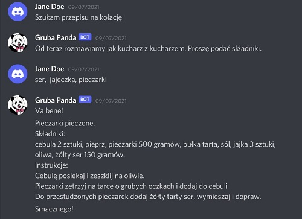
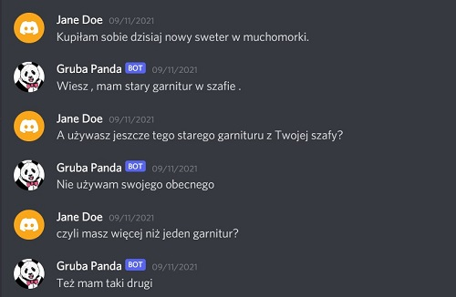
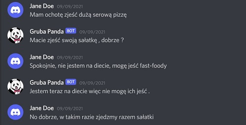

# Culinary Assistant

Chatbot created to find recipes based on given ingredients. Uses Machine Learning models to communicate with the user in Polish.

This is a shared project of [Zofia Kochutek](https://github.com/zofiakochutek) and [Paulina Landkocz](https://github.com/PaulinaLa).

## Setup

The simplest way is to run this project on 
[Google Colabolatory](https://drive.google.com/drive/folders/1HONBBNF1j8b-64wMMuyRmQlx8w3IX7IO?usp=sharing). 

## The chatbot knows how to
--- 
### Greet the user
 
 
* User: How are you?
* Bot: Im fine, how are you?

&nbsp;

--- 
### Introduce themself
 
* User: What is your name?
* Bot: My name is Gruba Panda.

&nbsp;

* User: What do you like to eat?
* Bot: My favourite dish is lasagne.

&nbsp;

 
---
### Answer general questions
#### In this mode chatbot uses the [Polish SQuAD2.0](https://huggingface.co/henryk/bert-base-multilingual-cased-finetuned-polish-squad2) model from the HuggingFace.

* User: What does Robert Makłowicz do?
* Bot: Ah! I did not expect such a question. I remember now... Food critic.

&nbsp;

 
* User: What is the capital of Poland?
* Bot: Tough question. I have to check it in an encyclopedia. I suppose it is Warszawa.

&nbsp;

 
* User: When did man land on the moon?
* Bot: One second! July 20, 1969.

&nbsp;

---
### Answer personal questions
#### In this mode chatbot uses [HerBERT](https://huggingface.co/allegro/herbert-large-cased).

 
* User: Do you like to listen to Beata Kozidrak?
* Bot: I like pop songs.

&nbsp;

 
* User: Do you prefer tomatoes or peaches?
* Bot: Personally I prefer polish plumps.

&nbsp;

---
### Find the recipe based on given ingredients

* User: I'm looking for a recipe for dinner
* Bot: Give me the ingredients.
* User: cheese, eggs, mushrooms
* Bot:\
Baked mushrooms. \
Ingredients: \
two onions, pepper, 500 grams of mushrooms, bread crumbs, salt, eggs, olive oil, 500 grams of cheese \
Directions: \
Chop the onion and fry in olive oil. Grate the mushrooms and add to the onion. Add cheese to the cooled mushrooms, mix and season.

&nbsp;

---
### Have a small talk with the user

 
* User: I bought a toadstool sweater today.
* Bot: I have an old suit in the closet.
* User: And do you still use it?
* Bot: I'm not using my current one.
* User: So do you have more than one?
* Bot: I also have a second.

&nbsp;

 
* User: I want to eat a large cheese pizza.
* Bot: You have to eat a salad, okay?
* User: Easy, I am not on diet, I can eat fast-food.
* Bot: I am on diet, so I can not eat them.
* User: Let's eat the salads then.
