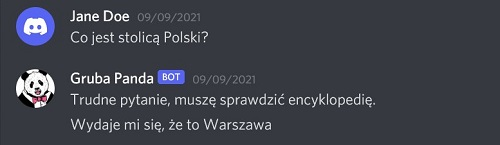

# Culinary Assistant

Chatbot created to find recipes based on given ingredients. Uses Machine Learning models to communicate with the user in Polish.

This is a shared project of [Zofia Kochutek](https://github.com/zofiakochutek) and [Paulina Landkocz](https://github.com/PaulinaLa).

## Setup

The simplest way is to run this project on 
[Google Colabolatory](https://drive.google.com/drive/folders/1HONBBNF1j8b-64wMMuyRmQlx8w3IX7IO?usp=sharing). 

## The chatbot knows how to
### Greet the user
 

### Introduce themself
 
 

### Answer general questions
In this mode chatbot uses the [Polish SQuAD2.0](https://huggingface.co/henryk/bert-base-multilingual-cased-finetuned-polish-squad2) model from the HuggingFace.
 
 
 

### Answer personal questions
In this mode chatbot uses [HerBERT](https://huggingface.co/allegro/herbert-large-cased).

 
 

### Find the recipe based on given ingredients
 

### Have a small talk with the user

 
 